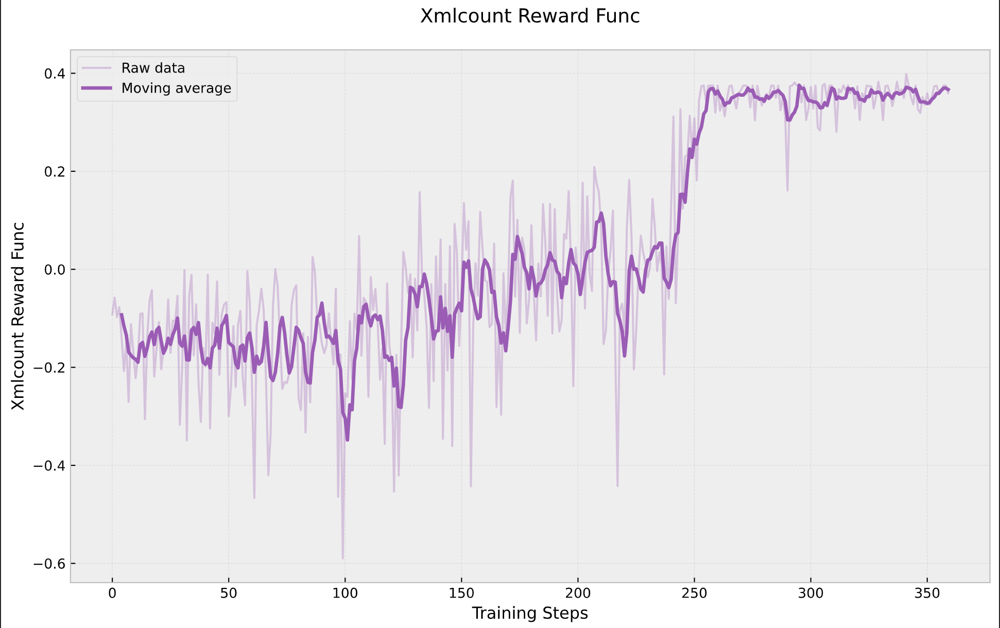
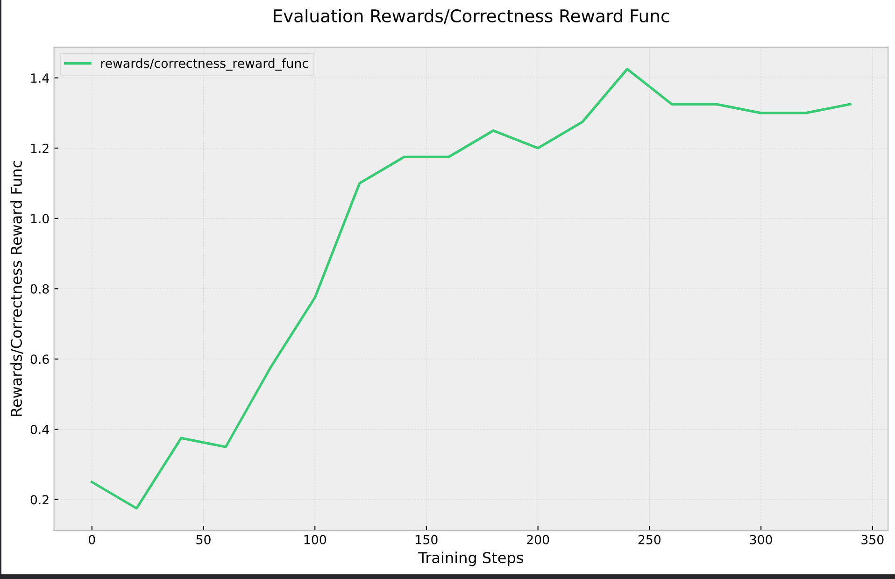

# DeepSeek R1 Implementation

## Motivation
I wanted to recreate DeepSeek R1's  results at a smaller scale, focusing on understanding the core mechanics by implementing everything from scratch. So this is a repo that trains Qwen1.5B on the [grade school math dataset](https://github.com/openai/grade-school-math).

This implementation heavily borrows from [Will Brown's  work](https://gist.github.com/willccbb/4676755236bb08cab5f4e54a0475d6fb) ([@willccbb](https://x.com/willccbb)), but restructures the code into a format optimized for learning and experimentation.

The key difference in my implementation is computing the GRPO loss function directly rather than using external RL libraries, and reformatting into a multi script repo.

I hope this might help other people understand things better, and maybe provide an easier way to try out smaller scale ideas etc. 

## Installation
```
pip install -r requirements.txt
```

Required environment variables:
```
export HUGGINGFACE_TOKEN="your-token-here"
huggingface-cli login
```

## Implementation Details

The system consists of several key modules:

### main.py
Contains the core training loop implementing GRPO (Generalized Reward-Powered Optimization). Handles model training, evaluation, and metric tracking. 

### llms.py 
Manages model loading and configuration, currently supporting LLaMA + Qwen models through Hugging Face's transformers library. Designed to be easily extensible to other model architectures.

### rldatasets.py
Handles dataset loading and preprocessing, currently focused on GSM8K math problems. Implements custom data loaders for both training and evaluation.

### evaluator.py
Contains evaluation metrics and reward functions, closely following DeepSeek's original implementation.

## Results
Training was conducted on a single H100 GPU. After ~400 training steps:



And results on the validation set - this shows a clearer sign of learning: 


## Future Directions
I'm really pleased to see how well the key mechanics work even in this simplified implementation. Building on this, I am very excited about several directions:

1. Adding self-play capabilities where agents compete and learn from each other using relative rewards. This would create a more dynamic training environment where the reward signal comes from agent interactions rather than fixed metrics.

2. Implementing soft reward structures, particularly for complex reasoning tasks. I've writing a framework for AI debate that I'm excited to try out.

3. Expanding into vision-language models (VLMs) to improve world modeling capabilities. I have an idea about using R1-style training to enhance how VLMs build and maintain internal world models that I'm really excited to explore. (Really excited about this idea - if anyone else is interested I would love to talk.)

4. I'd like to do all this experimentation in this framework, so I need to make things faster, and support multi-gpu training.


